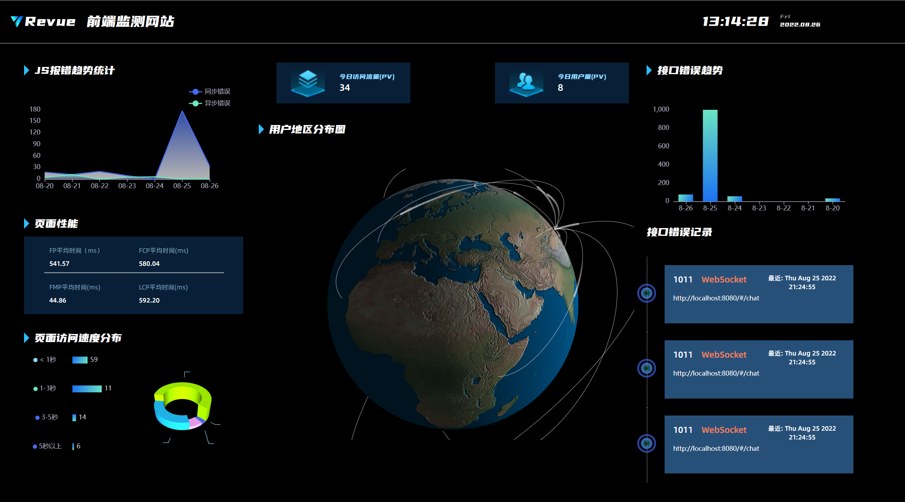

<div align=center style="height:200px; overflow:200px; border-radius:50px">
    
</div>

<p align="center">
 <a></a>
 <a></a>
 <a></a>
    
</p>

> 如果你是一位前端工程师，那你一定不止一次去解决一些顽固的线上问题，你也曾想方设法复现用户的bug，结果可能都不太理想。 怎样定位前端线上问题，一直以来，都是很头疼的问题，因为它发生于用户的一系列操作之后。错误的原因可能源于机型，网络环境，复杂的操作行为等等，在我们想要去解决的时候很难复现出来，自然也就无法解决。

> 身为一名前端工程师，我每天都要面临很多线上的问题，一时间让我焦头烂额。公司其他的监控系统也有，但是每次解决问题都需要辗转于各种监控系统之间，亦是疲惫不堪。所以，我便为自己（前端工程师）量身定做了这样一款监控系统，现在分享给大家使用，欢迎点击了解。

> 只需要简单几步，你就可以搭建一套属于自己的前端监控系统了。

## 快速上手

1. 在vue2 vue3项目中下载npm包 revue-monitor

   ```bash
   npm i revue-monitor
   ```
2. 私有化部署监控中台 或 使用在线的监控中台

  
   
   
   

3. 根据项目需求和侧重，插拔的局部使用插件

   中台网站，会根据插件的使用情况，智能的显示信息（在线监控中台）；并且您还可以根据独特的需求，扩展插件内容（通过自我开发或者使用在线开发者的插件）；具体使用方法，可    
   以查看[插件使用文档](https://gitee.com/re-vue-monitor/revue-monitor)